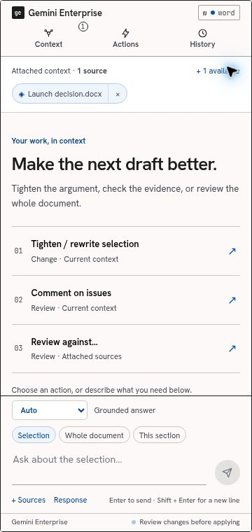
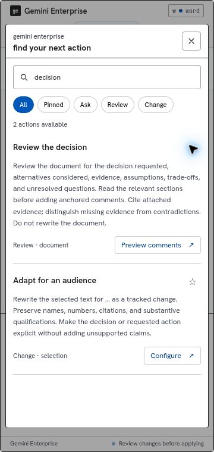
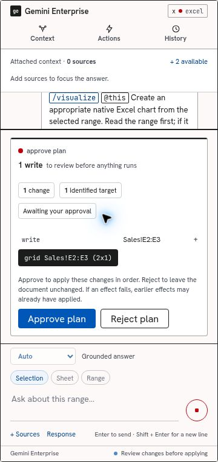

# Working in the pane

The active Microsoft surface stays the place where work happens. The pane supplies context,
actions, answers, and reviewable changes.

| Start with context | Find an action | Review changes |
| --- | --- | --- |
|  |  |  |

Screenshots show the scripted preview at 360 × 760 px. The Excel sample deliberately stages a
single illustrative effect; it is not evidence of a live model-generated chart or Office execution.

## Analyze tables and recover changes

Excel now has a **Data workbench** with versioned snapshots, exact-decimal reconciliation, finding
chips, SQL, reviewed writeback, readback receipts and recovery/undo. See
[Data workbench, evidence and recovery](COMPUTE-RECOVERY.md) for the workflow and operating limits.

## Start a task

The empty conversation presents three actions chosen for the current host. Open **Actions** to
search the complete catalog. Search matches labels, instructions, intent, and scope; multiple words
must all match. **Ask**, **Review**, and **Change** filters distinguish an answer from a mutation.
Pin an action to put it first and find it under **Pinned**. Pins contain catalog IDs only and are
local to the browser. A pinned action disappears when the current host cannot run it.

Parameterized actions open a short form. Fill every required field and inspect **Preview
instructions** if needed. The action retains its intent, scope, and sources when it runs.

| Surface | Added workflows | Result |
| --- | --- | --- |
| Word | Review the decision; adapt for an audience | Anchored comments or a tracked rewrite |
| Excel | Reconcile actuals and forecast; build a chart and analysis | Review comments or a staged native chart workflow |
| PowerPoint | Check claims against evidence; build a decision brief | Evidence gaps in chat or staged slides |
| OneNote | Compare sources; write a research brief | An evidence table in chat or a cited page synthesis |
| Outlook | Track commitments; draft a reply that closes the loop | An action table or an unsent reply draft |
| Teams | Build a decision log; find unresolved disagreements | Staged notes or an answer with transcript references |

These are curated instructions using existing capabilities. Quality depends on available source
content, the configured Gemini Enterprise engine and skills, and the host bridge. A workflow does
not create a missing connector, grant access, or unlock an unsupported Office API.

## Choose context deliberately

**Attached context** shows the sources already in the session. Expand the row to see nearby host
content. Click a source to attach it, × to remove it, or its title to locate it when the host bridge
supports reveal. Refresh asks the bridge for the current attachable objects. Document capture and
live reads still occur through the runtime; the attached-source count is not a count of every piece
of ambient context in a model request.

**+ Sources** in the composer is different: it selects connected, addressable sources for one
request. Data-store display names become removable chips; their exact resource names travel in
`dataStoreSpecs`. They clear after submission. This extends the current grounding; it is not a
strict exclusion filter or an authorization boundary. Use the Context row for host attachments.

The `/` and `@` text interfaces remain available. Picking an addressable mention kind opens its
concrete source list when available. Email addresses are not interpreted as source mentions.

## Shape the request

**Auto** lets the existing router and planner handle the request. Selecting **Rewrite**, **Review**,
**Draft**, or another available intent makes the task explicit without typing a slash command.
A typed slash verb takes precedence. The scope control specifies the selection, document, slide,
thread, or other supported scope.

**Response** adds explicit output instructions for format and style. These controls affect the
request sent to Gemini; they do not guarantee a schema-constrained response. Pasted command programs
remain intact and bypass prose formatting controls.

**Enter** sends; **Shift+Enter** inserts a line. Composition with an IME does not send prematurely.
**Ctrl+K / ⌘K** opens the action library. Escape closes the action dialog and restores focus.

## Use an answer

Completed answers have **Copy answer**. If clipboard access fails, the pane says to select and
copy the text. The latest completed answer also offers **Decision brief**, **Action checklist**,
and **Check evidence**. Each fills the composer for editing and sending; it does not issue a hidden
model request. Existing table/code insertion remains available only after the response completes.
Cancelled or failed content is not offered as an insertable artifact.

## Review changes

The plan shows the exact effect set: change count, known target count, individual commands, and
available dry-run values. Expand a change to inspect its resolved target and before/after preview.
Locate a supported target directly in the host. Approval applies the reviewed plan in order;
rejection applies none of it. This is not an atomic transaction: an execution failure can leave
previously successful effects applied. Reversibility and provenance persistence remain host-specific.

Task execution, context changes, and proposal acceptance are disabled while a turn or approval is
active. This prevents another UI operation from changing the work under review.

## Try it without Office

Run `bun run dev` and open the URL it prints. Choose **Try interactive demo**. The real
`PanelController` runs against a scripted session with sample content for each of the six hosts.
Attach sources, ask a question, run an action, and approve or reject its sample change. The demo
never calls a model or mutates an Office document. Toggle out of the demo for individual card
fixtures. Width controls cover 320, 360, and 480 px; height controls cover 480, 600, and 760 px.

The preview's `?demo=1` URL starts directly in the scripted mode. Real Office sideloading and a
configured Entra/Gemini tenant remain separate release checks.
